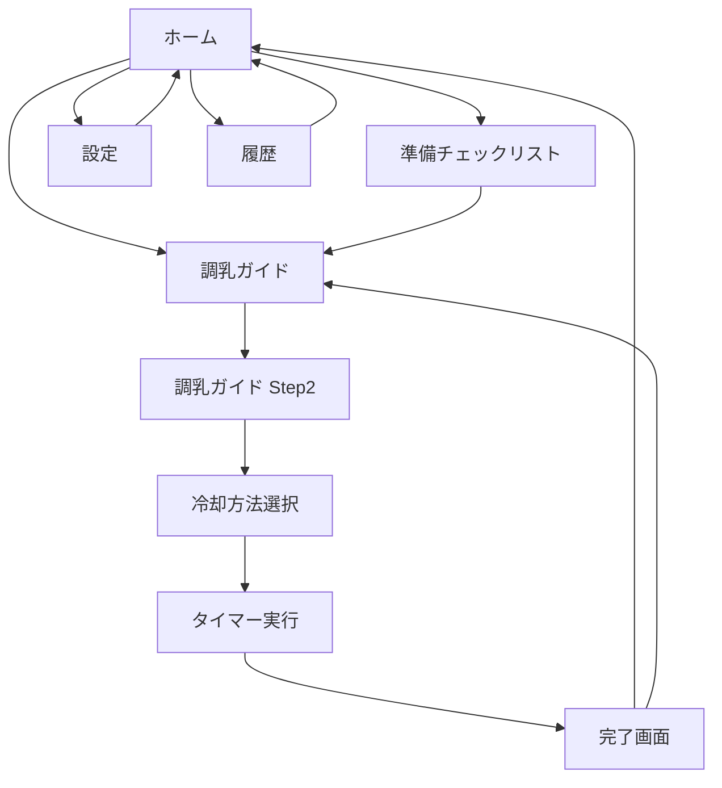

# アーキテクチャ設計 - 粉ミルク調乳タイマー

## システム全体アーキテクチャ

### 高レベルアーキテクチャ図

```
┌─────────────────────────────────────────────────────────────────┐
│                        User (Browser)                           │
└────────────────────────┬────────────────────────────────────────┘
                         │
                         ↓
┌─────────────────────────────────────────────────────────────────┐
│                      Nuxt 3 Application                         │
│  ┌──────────────┬──────────────┬─────────────┬────────────────┐ │
│  │ Presentation │ Application  │   Domain    │ Infrastructure │ │
│  │    Layer     │    Layer     │    Layer    │     Layer      │ │
│  ├──────────────┼──────────────┼─────────────┼────────────────┤ │
│  │ Pages/       │ Composables/ │ Utils/      │ Plugins/       │ │
│  │ Components   │ Stores       │ Types       │ API            │ │
│  └──────────────┴──────────────┴─────────────┴────────────────┘ │
└─────────────────────────────────────────────────────────────────┘
                         │
                         ↓
┌─────────────────────────────────────────────────────────────────┐
│                     Browser APIs & Storage                      │
│  ┌───────────┬──────────────┬──────────────┬─────────────────┐ │
│  │ IndexedDB │  localStorage│  Vibration   │  Notification   │ │
│  └───────────┴──────────────┴──────────────┴─────────────────┘ │
└─────────────────────────────────────────────────────────────────┘
                         │
                         ↓
┌─────────────────────────────────────────────────────────────────┐
│                    Firebase Services (将来)                     │
│  ┌───────────┬──────────────┬──────────────┬─────────────────┐ │
│  │  Hosting  │   Firestore  │     FCM      │   Analytics     │ │
│  └───────────┴──────────────┴──────────────┴─────────────────┘ │
└─────────────────────────────────────────────────────────────────┘
```

---

## レイヤー別詳細設計

### Presentation Layer（プレゼンテーション層）

**責務**: UIの表示、ユーザー入力の受付

#### Pages（ページコンポーネント）

```
pages/
├── index.vue                # ホーム画面
├── prepare.vue              # 準備チェックリスト
├── settings.vue             # 設定画面
├── guide.vue                # 調乳ガイド（Step 1/2）
├── cooling.vue              # 冷却方法選択
├── timer.vue                # タイマー実行画面
├── complete.vue             # 完了画面
└── history.vue              # 履歴画面
```

#### Components（コンポーネント階層）

```
components/
├── atoms/                   # 原子（最小単位）
│   ├── Button.vue
│   ├── Input.vue
│   ├── Icon.vue
│   ├── Badge.vue
│   └── Slider.vue
│
├── molecules/               # 分子（原子の組み合わせ）
│   ├── TemperatureDisplay.vue    # 温度表示
│   ├── ProgressBar.vue           # 進捗バー
│   ├── ShakeButton.vue           # 揺らしボタン
│   ├── CoolingMethodCard.vue     # 冷却方法カード
│   └── StatCard.vue              # 統計カード
│
├── organisms/               # 有機体（複雑な機能）
│   ├── bottle/
│   │   ├── BottleVisual.vue      # 哺乳瓶ビジュアル
│   │   └── TemperatureGradient.vue # 温度グラデーション
│   ├── timer/
│   │   ├── TimerDisplay.vue      # タイマー表示
│   │   ├── TimerControls.vue     # タイマー操作
│   │   ├── TemperatureChart.vue  # 温度グラフ
│   │   └── ShakeReminder.vue     # 揺らしリマインダー
│   ├── settings/
│   │   ├── VolumeSelector.vue    # ミルク量選択
│   │   ├── MaterialSelector.vue  # 材質選択
│   │   └── TargetTempSlider.vue  # 目標温度スライダー
│   └── history/
│       ├── SessionList.vue       # セッションリスト
│       └── StatisticsPanel.vue   # 統計パネル
│
└── templates/               # テンプレート（将来的に使用）
    ├── TimerTemplate.vue
    └── SettingsTemplate.vue
```

### Application Layer（アプリケーション層）

**責務**: ビジネスロジックの組み立て、状態管理

#### Composables（再利用可能なロジック）

```typescript
// composables/useThermalEngine.ts
export const useThermalEngine = () => {
  /**
   * 熱力学計算エンジン
   * - 温度計算
   * - 冷却時間予測
   * - 冷却定数計算
   */
  const calculateTemperature = (params: ThermalParams): number => {
    const k = calculateCoolingConstant(params);
    return calculateNewtonCooling(
      params.initialTemp,
      params.elapsedTime,
      params.method.ambientTemp,
      k
    );
  };

  const predictCoolingTime = (params: PredictParams): number => {
    const k = calculateCoolingConstant(params);
    return calculateTimeToTarget(
      params.initialTemp,
      params.targetTemp,
      params.method.ambientTemp,
      k
    );
  };

  return { calculateTemperature, predictCoolingTime };
};
```

```typescript
// composables/useTimer.ts
export const useTimer = () => {
  /**
   * タイマー管理
   * - 開始/停止/リセット
   * - 経過時間管理
   * - リアルタイム温度更新
   */
  const timerStore = useTimerStore();
  const { calculateTemperature } = useThermalEngine();

  const start = () => {
    timerStore.start();
    startInterval();
  };

  const pause = () => {
    timerStore.pause();
    stopInterval();
  };

  const currentTemp = computed(() => {
    return calculateTemperature({
      initialTemp: timerStore.initialTemp,
      elapsedTime: timerStore.elapsedTime / 60,
      material: timerStore.material,
      method: timerStore.method,
    });
  });

  return { start, pause, reset, currentTemp };
};
```

```typescript
// composables/useVibration.ts
export const useVibration = () => {
  /**
   * バイブレーション管理
   * - 揺らしリマインダー
   * - 適温到達通知
   */
  const vibrate = (pattern: number | number[]) => {
    if ('vibrate' in navigator) {
      navigator.vibrate(pattern);
    }
  };

  const vibrateShakeReminder = () => vibrate(200);
  const vibrateComplete = () => vibrate([200, 100, 200, 100, 200]);

  return { vibrate, vibrateShakeReminder, vibrateComplete };
};
```

```typescript
// composables/useNotification.ts
export const useNotification = () => {
  /**
   * 通知管理
   * - 適温到達通知
   * - パーミッション管理
   */
  const requestPermission = async (): Promise<boolean> => {
    if ('Notification' in window) {
      const permission = await Notification.requestPermission();
      return permission === 'granted';
    }
    return false;
  };

  const notifyComplete = (temp: number) => {
    if (Notification.permission === 'granted') {
      new Notification('適温になりました！', {
        body: `現在の温度: ${temp.toFixed(1)}°C`,
        icon: '/icons/icon-192.png',
        vibrate: [200, 100, 200, 100, 200],
      });
    }
  };

  return { requestPermission, notifyComplete };
};
```

```typescript
// composables/useHistory.ts
export const useHistory = () => {
  /**
   * 履歴管理
   * - セッション保存
   * - 統計計算
   * - データ取得
   */
  const saveSession = async (session: MilkSession): Promise<void> => {
    await db.sessions.add(session);
  };

  const getSessions = async (limit = 100): Promise<MilkSession[]> => {
    return await db.sessions
      .orderBy('timestamp')
      .reverse()
      .limit(limit)
      .toArray();
  };

  const getStatistics = async (): Promise<Statistics> => {
    const sessions = await getSessions();
    return {
      averageTime: calculateAverage(sessions.map(s => s.actualTime || 0)),
      totalCount: sessions.length,
      mostUsedMethod: findMostCommon(sessions.map(s => s.coolingMethodId)),
    };
  };

  return { saveSession, getSessions, getStatistics };
};
```

#### Stores（Pinia）

```typescript
// stores/settings.ts
export const useSettingsStore = defineStore('settings', () => {
  // State
  const volume = ref(140);
  const bottleMaterialId = ref('glass');
  const targetTemp = ref(38);
  const roomTemp = ref(20);
  const coldWaterTemp = ref(5);

  // Getters
  const material = computed(() => MATERIALS[bottleMaterialId.value]);

  // Actions
  const updateVolume = (newVolume: number) => {
    volume.value = newVolume;
  };

  return {
    volume,
    bottleMaterialId,
    targetTemp,
    roomTemp,
    coldWaterTemp,
    material,
    updateVolume,
  };
}, {
  persist: true, // localStorage に自動保存
});
```

```typescript
// stores/timer.ts
export const useTimerStore = defineStore('timer', () => {
  // State
  const isRunning = ref(false);
  const elapsedTime = ref(0); // 秒
  const initialTemp = ref(46.6);
  const targetTemp = ref(38);
  const shakeCount = ref(0);
  const methodId = ref('ice_stir');

  // Getters
  const method = computed(() => COOLING_METHODS[methodId.value]);
  const material = computed(() => {
    const settings = useSettingsStore();
    return settings.material;
  });

  // Actions
  const start = () => {
    isRunning.value = true;
  };

  const pause = () => {
    isRunning.value = false;
  };

  const reset = () => {
    isRunning.value = false;
    elapsedTime.value = 0;
    shakeCount.value = 0;
  };

  const incrementShake = () => {
    shakeCount.value += 1;
  };

  return {
    isRunning,
    elapsedTime,
    initialTemp,
    targetTemp,
    shakeCount,
    methodId,
    method,
    material,
    start,
    pause,
    reset,
    incrementShake,
  };
});
```

```typescript
// stores/history.ts
export const useHistoryStore = defineStore('history', () => {
  const sessions = ref<MilkSession[]>([]);

  const loadSessions = async () => {
    const { getSessions } = useHistory();
    sessions.value = await getSessions();
  };

  const addSession = async (session: MilkSession) => {
    const { saveSession } = useHistory();
    await saveSession(session);
    await loadSessions();
  };

  return { sessions, loadSessions, addSession };
});
```

---

### Domain Layer（ドメイン層）

**責務**: 純粋な計算ロジック、ビジネスルール

#### Utils（ユーティリティ関数）

```
utils/
├── thermal/
│   ├── constants.ts         # 物理定数
│   ├── materials.ts         # 材質パラメータ
│   ├── methods.ts           # 冷却方法パラメータ
│   └── calculator.ts        # 温度計算関数
├── color.ts                 # 色補間関数
└── format.ts                # フォーマット関数
```

#### Types（型定義）

```
types/
├── thermal.ts               # 熱力学関連の型
├── session.ts               # セッション関連の型
├── bottle.ts                # 哺乳瓶関連の型
└── cooling.ts               # 冷却方法関連の型
```

---

### Infrastructure Layer（インフラ層）

**責務**: 外部API、データベース、ブラウザAPI

#### Plugins

```typescript
// plugins/dexie.client.ts
import Dexie from 'dexie';

class MilkTimerDB extends Dexie {
  sessions!: Table<MilkSession>;

  constructor() {
    super('MilkTimerDB');
    this.version(1).stores({
      sessions: '++id, timestamp, volume, coolingMethodId',
    });
  }
}

export const db = new MilkTimerDB();
```

```typescript
// plugins/firebase.client.ts
import { initializeApp } from 'firebase/app';

export default defineNuxtPlugin(() => {
  const config = useRuntimeConfig();
  const app = initializeApp(config.public.firebase);

  return {
    provide: {
      firebase: app,
    },
  };
});
```

---

## データフロー図

### タイマー実行時のデータフロー

```
┌─────────────┐
│ User Action │
│ (Start)     │
└──────┬──────┘
       │
       ↓
┌──────────────────┐
│ TimerControls    │  Component
│ @click="start"   │
└──────┬───────────┘
       │
       ↓
┌──────────────────┐
│ useTimer()       │  Composable
│ start()          │
└──────┬───────────┘
       │
       ↓
┌──────────────────┐
│ useTimerStore()  │  Store (Pinia)
│ isRunning=true   │
└──────┬───────────┘
       │
       ↓
┌──────────────────┐
│ setInterval()    │  Timer Loop
│ (1秒ごと)        │
└──────┬───────────┘
       │
       ↓
┌──────────────────┐
│ useThermalEngine │  Composable
│ calculateTemp()  │
└──────┬───────────┘
       │
       ↓
┌──────────────────┐
│ calculator.ts    │  Utils
│ ニュートンの     │
│ 冷却法則         │
└──────┬───────────┘
       │
       ↓
┌──────────────────┐
│ Computed         │
│ currentTemp      │
└──────┬───────────┘
       │
       ↓
┌──────────────────┐
│ Template         │
│ {{ currentTemp }}│  UI Update
└──────────────────┘
```

### 履歴保存時のデータフロー

```
┌─────────────┐
│ User Action │
│ (Complete)  │
└──────┬──────┘
       │
       ↓
┌──────────────────┐
│ Complete Page    │
│ save()           │
└──────┬───────────┘
       │
       ↓
┌──────────────────┐
│ useHistory()     │  Composable
│ saveSession()    │
└──────┬───────────┘
       │
       ↓
┌──────────────────┐
│ Dexie.js         │  IndexedDB
│ db.sessions.add()│
└──────┬───────────┘
       │
       ↓
┌──────────────────┐
│ IndexedDB        │  Browser Storage
│ (Persistent)     │
└──────────────────┘
```

---

## コンポーネント依存関係図

```
pages/timer.vue
    ├── organisms/timer/TimerDisplay.vue
    │   ├── molecules/TemperatureDisplay.vue
    │   │   └── atoms/Badge.vue
    │   └── molecules/ProgressBar.vue
    ├── organisms/bottle/BottleVisual.vue
    │   └── organisms/bottle/TemperatureGradient.vue
    ├── organisms/timer/TemperatureChart.vue
    ├── organisms/timer/ShakeReminder.vue
    │   ├── molecules/ShakeButton.vue
    │   │   └── atoms/Button.vue
    │   └── atoms/Icon.vue
    └── organisms/timer/TimerControls.vue
        └── atoms/Button.vue
```

---

## 熱力学計算エンジンの詳細設計

### クラス図（概念）

```
┌─────────────────────────┐
│ ThermalCalculator       │
├─────────────────────────┤
│ + calculateTemp()       │
│ + predictTime()         │
│ + getCoolingConstant()  │
└─────────────────────────┘
         ↓ uses
┌─────────────────────────┐
│ BottleMaterial          │
├─────────────────────────┤
│ - thermalConductivity   │
│ - thickness             │
│ - density               │
│ - specificHeat          │
└─────────────────────────┘

┌─────────────────────────┐
│ CoolingMethod           │
├─────────────────────────┤
│ - ambientTemp           │
│ - velocity              │
│ - baseH                 │
│ - velocityFactor        │
└─────────────────────────┘
```

### 計算フロー

```
Input: initialTemp, targetTemp, volume, material, method
   │
   ↓
calculateCoolingConstant(volume, material, method)
   │
   ├─> 質量計算: m = (volume / 1000) * WATER_DENSITY
   │
   ├─> 表面積計算: A = 2πrh
   │
   ├─> 熱伝達係数: h = baseH * sqrt(velocity / 0.1 + 1)
   │
   └─> 冷却定数: k = (h * A) / (m * c)
   │
   ↓
calculateTimeToTarget(initialTemp, targetTemp, ambient, k)
   │
   └─> t = -ln((T_target - T_ambient) / (T_initial - T_ambient)) / k
   │
   ↓
Output: 予測時間（分）
```

---

## ルーティング設計

### ページ遷移図（Mermaid）



### ルート定義

```typescript
// Nuxt 3 の自動ルーティング
{
  '/': 'pages/index.vue',
  '/prepare': 'pages/prepare.vue',
  '/settings': 'pages/settings.vue',
  '/guide': 'pages/guide.vue',
  '/cooling': 'pages/cooling.vue',
  '/timer': 'pages/timer.vue',
  '/complete': 'pages/complete.vue',
  '/history': 'pages/history.vue',
}
```

---

## 拡張性の考慮

### 新しい冷却方法の追加

```typescript
// utils/thermal/methods.ts に追加するだけ
export const COOLING_METHODS = {
  // 既存
  ice_stir: { /* ... */ },

  // 新規追加
  ultrasonic_bath: {
    id: 'ultrasonic_bath',
    name: '超音波冷却',
    description: '超音波で均一冷却',
    ambientTemp: 10,
    velocity: 0.2,
    baseH: 250,
    velocityFactor: 1.8,
    recommendedPriority: 2,
  },
};

// 既存コードは変更不要（開放閉鎖の原則）
```

### 新しい材質の追加

```typescript
// utils/thermal/materials.ts に追加
export const MATERIALS = {
  // 既存
  glass: { /* ... */ },

  // 新規追加
  silicon: {
    id: 'silicon',
    name: 'シリコン',
    thermalConductivity: 0.15,
    thickness: 0.004,
    density: 1100,
    specificHeat: 1300,
  },
};
```

---

このアーキテクチャにより、保守性・拡張性・テスト容易性の高いシステムを実現します。
