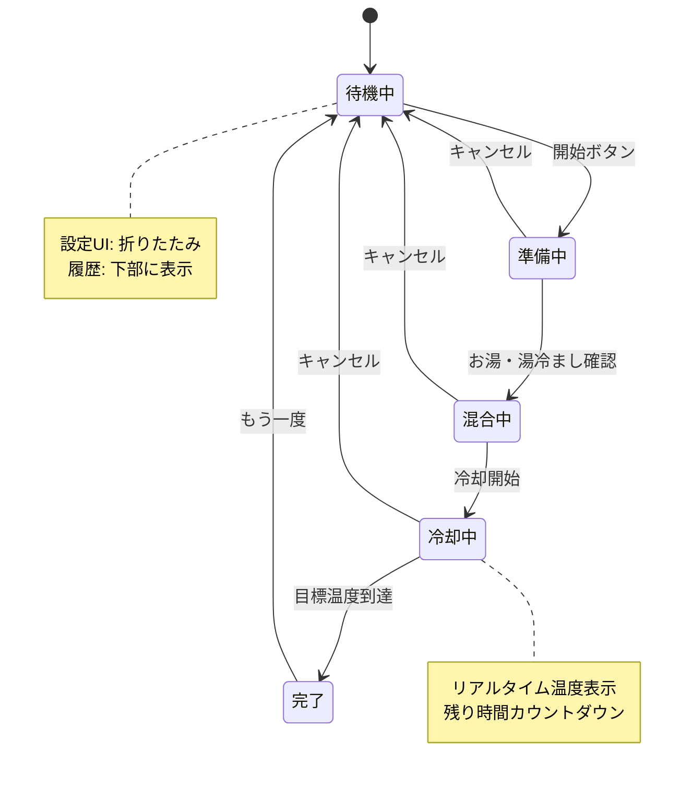

# 画面遷移設計 - みるくっく (シングルページアプリ)

## 設計思想

みるくっくは**シングルページアプリケーション(SPA)**として設計します。

### なぜシングルページなのか？

1. **本質的な機能**: 調乳タイマーという単一の目的
2. **連続したフロー**: 準備→混合→冷却→完了は一連の流れ
3. **シンプルなUX**: ページ遷移のないスムーズな体験
4. **モバイルファースト**: スマホのタイマーアプリのような使い心地

## 状態遷移図



---

## 画面状態の詳細

### 状態1: 待機中 (Idle)

#### 表示内容
```
┌─────────────────────────┐
│  🍼 みるくっく          │
├─────────────────────────┤
│                         │
│  [ミルク量: 140ml] ←🎚   │
│  ガラス瓶 / 氷水攪拌     │
│                         │
│  ┌─────────────────┐   │
│  │   開始する       │   │
│  └─────────────────┘   │
│                         │
│  ⚙️ 詳細設定 ▼          │
│  📊 今日: 3回 420ml     │
└─────────────────────────┘
```

#### 機能
- ミルク量スライダー (60-240ml)
- 簡易設定表示(材質/冷却方法)
- 「開始する」ボタン(大きく)
- 詳細設定の折りたたみ
- 今日の記録サマリー

#### データ
```typescript
{
  status: 'idle',
  volume: 140,
  materialId: 'glass',
  coolingMethodId: 'ice_stir',
  showSettings: false, // 詳細設定の開閉状態
}
```

---

### 状態2: 準備中 (Preparing)

#### 表示内容
```
┌─────────────────────────┐
│  準備チェック           │
├─────────────────────────┤
│                         │
│  ✅ お湯 (85°C以上)     │
│  ✅ 湯冷まし (20°C)     │
│  ✅ 哺乳瓶とミルク       │
│  ✅ 氷水を準備           │
│                         │
│  ┌─────────────────┐   │
│  │   次へ           │   │
│  └─────────────────┘   │
│  [キャンセル]            │
└─────────────────────────┘
```

#### 機能
- 準備物のチェックリスト表示
- 「次へ」ボタン
- キャンセルボタン

---

### 状態3: 混合中 (Mixing)

#### 表示内容
```
┌─────────────────────────┐
│  ステップ1: お湯を入れる │
├─────────────────────────┤
│                         │
│    🌡️ 108ml             │
│    85°Cのお湯           │
│                         │
│  ✓ 入れました            │
│                         │
├─────────────────────────┤
│  ステップ2: 湯冷ましを   │
│                         │
│    💧 32ml              │
│    20°Cの湯冷まし       │
│                         │
│  ✓ 入れました            │
│                         │
├─────────────────────────┤
│  ステップ3: ミルクを溶かす│
│  粉ミルクを入れて溶かす   │
│                         │
│  ✓ 溶かしました          │
│                         │
│  ┌─────────────────┐   │
│  │ 冷却を開始する    │   │
│  └─────────────────┘   │
└─────────────────────────┘
```

#### 機能
- 3ステップのガイド表示
- 各ステップのチェックボックス
- 「冷却を開始する」ボタン(全チェック後に有効化)

#### データ
```typescript
{
  status: 'mixing',
  hotWaterVolume: 108,
  coldWaterVolume: 32,
  initialTemp: 46.6,
  steps: {
    hotWater: false,
    coldWater: false,
    powder: false,
  }
}
```

---

### 状態4: 冷却中 (Cooling)

#### 表示内容
```
┌─────────────────────────┐
│  冷却中                  │
├─────────────────────────┤
│                         │
│      46.6°C             │
│       ↓                 │
│      38.0°C             │
│                         │
│  ████████░░░░░ 65%     │
│                         │
│  残り時間: 2分30秒       │
│                         │
│  🧊 氷水攪拌中           │
│  哺乳瓶を軽く揺らして    │
│  ください                │
│                         │
│  [キャンセル]            │
└─────────────────────────┘
```

#### 機能
- 現在温度の大きな表示
- 目標温度の表示
- プログレスバー
- 残り時間カウントダウン
- 冷却方法のヒント
- キャンセルボタン

#### リアルタイム更新
- 1秒ごとに経過時間を更新
- ニュートンの冷却法則で現在温度を計算
- 残り時間を再計算

#### データ
```typescript
{
  status: 'cooling',
  currentTemp: 46.6, // 計算値
  targetTemp: 38,
  startTime: Date,
  elapsedSeconds: 0,
  predictedTime: 87, // 秒
  progress: 0.65, // 0-1
}
```

---

### 状態5: 完了 (Completed)

#### 表示内容
```
┌─────────────────────────┐
│  ✅ 適温になりました!    │
├─────────────────────────┤
│                         │
│      38.0°C             │
│                         │
│  🎉 完了                 │
│  実際の冷却時間: 1分23秒 │
│                         │
│  ┌─────────────────┐   │
│  │ もう一度作る      │   │
│  └─────────────────┘   │
│                         │
│  [ホームに戻る]          │
└─────────────────────────┘
```

#### 機能
- 完了メッセージ
- 実際の冷却時間表示
- 「もう一度作る」ボタン
- 「ホームに戻る」ボタン
- 自動で履歴に保存

---

## UI構造

### app.vue (シングルページ)

```vue
<template>
  <div class="app">
    <!-- ヘッダー -->
    <header v-if="status === 'idle'">
      <h1>🍼 みるくっく</h1>
    </header>

    <!-- メインコンテンツ(状態によって切り替え) -->
    <main>
      <IdleScreen v-if="status === 'idle'" />
      <PreparingScreen v-else-if="status === 'preparing'" />
      <MixingScreen v-else-if="status === 'mixing'" />
      <CoolingScreen v-else-if="status === 'cooling'" />
      <CompletedScreen v-else-if="status === 'completed'" />
    </main>

    <!-- 設定モーダル(オプション) -->
    <SettingsModal v-if="showSettings" />
  </div>
</template>
```

### コンポーネント構成

```
app.vue (メインアプリ)
├─ components/
│  ├─ IdleScreen.vue          # 待機画面
│  ├─ PreparingScreen.vue     # 準備チェック
│  ├─ MixingScreen.vue         # 混合ガイド
│  ├─ CoolingScreen.vue        # タイマー実行
│  ├─ CompletedScreen.vue      # 完了画面
│  ├─ SettingsPanel.vue        # 設定パネル(折りたたみ)
│  └─ HistorySummary.vue       # 履歴サマリー
├─ stores/
│  ├─ session.ts               # セッション管理
│  ├─ settings.ts              # 設定管理
│  └─ history.ts               # 履歴管理
└─ composables/
   └─ useThermalEngine.ts      # 熱計算エンジン
```

---

## 状態管理

### SessionStore

```typescript
{
  // 現在の状態
  status: 'idle' | 'preparing' | 'mixing' | 'cooling' | 'completed',

  // セッションデータ
  currentSession: {
    volume: 140,
    materialId: 'glass',
    coolingMethodId: 'ice_stir',
    targetTemp: 38,
    // ...
  },

  // 冷却データ
  cooling: {
    startTime: Date | null,
    elapsedSeconds: 0,
    currentTemp: 46.6,
    predictedTime: 87,
  },

  // UI状態
  ui: {
    showSettings: false,
    showHistory: false,
  }
}
```

---

## ページ遷移は不要

**重要**: このアプリは`pages/`ディレクトリを使用しません。

- ✅ `app.vue`のみで完結
- ✅ 状態(state)によってコンポーネントを切り替え
- ✅ ルーティング不要
- ✅ URLは常に`/`

### メリット

1. **シンプル**: ルーターの複雑さがない
2. **高速**: ページ遷移のオーバーヘッドなし
3. **スムーズ**: アニメーション/トランジションが自由
4. **状態保持**: 戻る/進むで状態が壊れない

---

## アニメーション

状態遷移時にスムーズなアニメーションを追加:

```vue
<Transition name="fade" mode="out-in">
  <component :is="currentScreen" />
</Transition>
```

```css
.fade-enter-active,
.fade-leave-active {
  transition: opacity 0.3s;
}

.fade-enter-from,
.fade-leave-to {
  opacity: 0;
}
```

---

## モバイル対応

- レスポンシブデザイン
- タッチジェスチャー対応
- PWA対応(後のフェーズ)
- オフライン動作

---

## まとめ

**みるくっく = 1つの画面 + 5つの状態**

- シンプルで直感的
- 高速でスムーズ
- モバイルフレンドリー
- メンテナンスしやすい

この設計により、ユーザーは迷わず調乳に集中できます。
