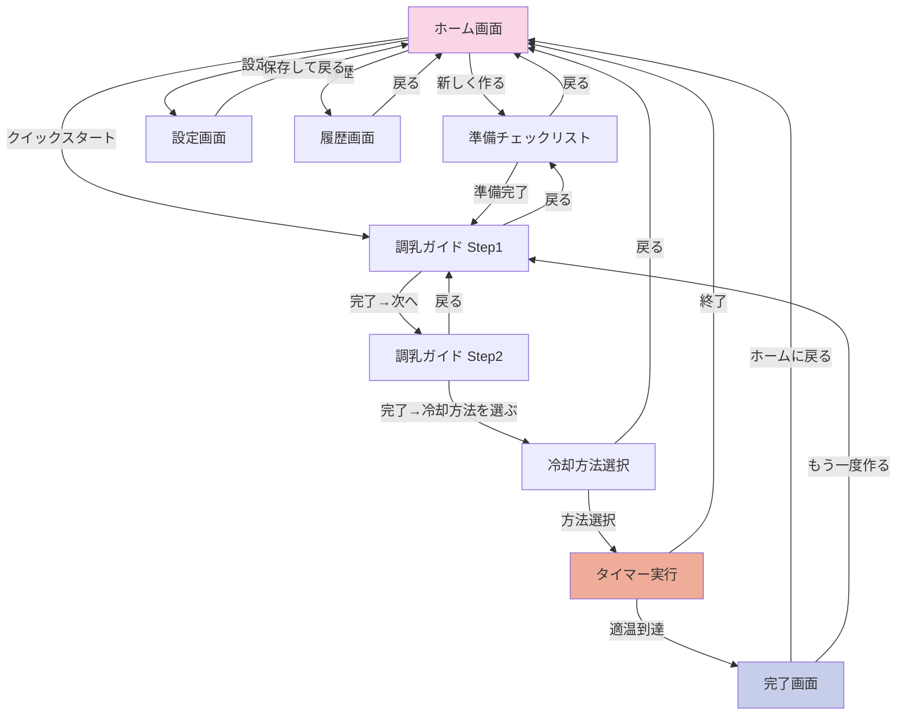

# 画面遷移設計 - 粉ミルク調乳タイマー

## 画面遷移図

### 全体フロー（Mermaid）



---

## 各画面の詳細設計

### 1. ホーム画面 (`pages/index.vue`)

#### 責務
- アプリの起点
- クイックスタート提供
- メニューへのアクセス

#### URL
```
/
```

#### 主要コンポーネント
- クイックスタートボタン
- 新規調乳開始ボタン
- 設定・履歴へのリンク
- ヒント表示

#### 遷移先
- `/prepare`: 新しく調乳する
- `/guide`: クイックスタート
- `/settings`: 設定
- `/history`: 履歴

#### 状態
- 前回の設定を表示（クイックスタート用）

#### 実装例
```vue
<script setup lang="ts">
const settingsStore = useSettingsStore();
const router = useRouter();

const quickStart = () => {
  router.push('/guide');
};

const newSession = () => {
  router.push('/prepare');
};
</script>

<template>
  <div class="home-screen">
    <h1>調乳タイマー</h1>

    <!-- メインアクション -->
    <button @click="newSession">新しく作る</button>

    <!-- クイックスタート -->
    <div class="quick-start">
      <p>前回の設定: {{ settingsStore.volume }}ml, {{ settingsStore.material.name }}</p>
      <button @click="quickStart">この設定で始める</button>
    </div>

    <!-- メニュー -->
    <nav>
      <NuxtLink to="/settings">設定</NuxtLink>
      <NuxtLink to="/history">履歴</NuxtLink>
    </nav>
  </div>
</template>
```

---

### 2. 準備チェックリスト画面 (`pages/prepare.vue`)

#### 責務
- 調乳前の準備確認
- チェックリスト表示

#### URL
```
/prepare
```

#### 主要コンポーネント
- チェックリストアイテム
  - 保冷剤を凍らせる
  - ボウルを用意
  - 湯冷ましを用意

#### 遷移先
- `/guide`: 準備完了
- `/`: 戻る

#### 実装例
```vue
<script setup lang="ts">
const checkItems = ref([
  { id: 1, label: '保冷剤を2-3個凍らせる', checked: false },
  { id: 2, label: 'ボウルを用意', checked: false },
  { id: 3, label: '湯冷ましを用意', checked: false },
]);

const allChecked = computed(() => checkItems.value.every(item => item.checked));
</script>
```

---

### 3. 設定画面 (`pages/settings.vue`)

#### 責務
- ユーザー設定の変更
- 設定の永続化

#### URL
```
/settings
```

#### 設定項目
1. **ミルク量**: 100ml / 120ml / 140ml / 160ml / 200ml / 240ml
2. **哺乳瓶材質**: ガラス / プラスチック / PPSU
3. **湯冷まし温度**: 冷蔵庫(5°C) / 常温(20°C) / カスタム
4. **目標温度**: 36°C〜40°C（スライダー）
5. **室温**: 15°C〜30°C（スライダー）

#### 遷移先
- `/`: 保存して戻る

#### 実装例
```vue
<script setup lang="ts">
const settingsStore = useSettingsStore();

const saveSettings = () => {
  // Piniaのpersistプラグインで自動保存
  navigateTo('/');
};
</script>

<template>
  <div class="settings-screen">
    <h2>設定</h2>

    <!-- ミルク量 -->
    <div class="setting-section">
      <label>ミルク量</label>
      <div class="button-group">
        <button
          v-for="vol in [100, 120, 140, 160, 200, 240]"
          :key="vol"
          :class="{ active: settingsStore.volume === vol }"
          @click="settingsStore.volume = vol"
        >
          {{ vol }}ml
        </button>
      </div>
    </div>

    <!-- 材質 -->
    <div class="setting-section">
      <label>哺乳瓶の材質</label>
      <div class="button-group">
        <button
          v-for="mat in ['glass', 'plastic', 'ppsu']"
          :key="mat"
          :class="{ active: settingsStore.bottleMaterialId === mat }"
          @click="settingsStore.bottleMaterialId = mat"
        >
          {{ MATERIALS[mat].name }}
        </button>
      </div>
    </div>

    <!-- 目標温度 -->
    <div class="setting-section">
      <label>目標温度: {{ settingsStore.targetTemp }}°C</label>
      <input
        v-model.number="settingsStore.targetTemp"
        type="range"
        min="36"
        max="40"
        step="1"
      />
    </div>

    <button @click="saveSettings">保存して戻る</button>
  </div>
</template>
```

---

### 4. 調乳ガイド Step1 (`pages/guide.vue`)

#### 責務
- お湯の量を計算・表示
- 粉ミルクを溶かす指示

#### URL
```
/guide
```

#### 表示内容
- お湯の温度（85°C固定）
- お湯の量（計算結果）
- ビジュアル表示

#### 計算ロジック
```typescript
// お湯と湯冷ましの量を計算
const hotWaterTemp = 85; // °C
const coldWaterTemp = settingsStore.coldWaterTemp; // 5°C or 20°C
const targetMixTemp = 46.6; // 混合後の目標温度

// 熱量保存則
// hotWater * hotWaterTemp + coldWater * coldWaterTemp = totalVolume * targetMixTemp
const hotWaterVolume = computed(() => {
  const total = settingsStore.volume;
  return (total * (targetMixTemp - coldWaterTemp)) / (hotWaterTemp - coldWaterTemp);
});

const coldWaterVolume = computed(() => {
  return settingsStore.volume - hotWaterVolume.value;
});
```

#### 遷移先
- `/guide?step=2`: 次のステップ

---

### 5. 調乳ガイド Step2 (`pages/guide.vue?step=2`)

#### 責務
- 湯冷ましの量を表示
- 混合後の温度を表示

#### URL
```
/guide?step=2
```

#### 表示内容
- 湯冷ましの量
- 混合後の予測温度
- ビジュアル表示

#### 遷移先
- `/cooling`: 冷却方法選択へ

---

### 6. 冷却方法選択画面 (`pages/cooling.vue`)

#### 責務
- 5つの冷却方法を提示
- 予測時間と特徴を表示
- おすすめ方法の提案

#### URL
```
/cooling
```

#### 主要コンポーネント
- CoolingMethodCard × 5
- 予測時間計算

#### 冷却方法一覧
1. **氷水攪拌** ⭐推奨
2. **氷水静置**
3. **流水冷却**
4. **氷水+流水**
5. **常温放置**

#### 実装例
```vue
<script setup lang="ts">
const settingsStore = useSettingsStore();
const timerStore = useTimerStore();
const { predictCoolingTime } = useThermalEngine();

const coolingMethods = computed(() => {
  return Object.values(COOLING_METHODS).map(method => ({
    ...method,
    predictedTime: predictCoolingTime({
      initialTemp: 46.6,
      targetTemp: settingsStore.targetTemp,
      volume: settingsStore.volume,
      material: settingsStore.material,
      method,
    }),
  })).sort((a, b) => a.recommendedPriority - b.recommendedPriority);
});

const selectMethod = (methodId: string) => {
  timerStore.methodId = methodId;
  navigateTo('/timer');
};
</script>

<template>
  <div class="cooling-screen">
    <h2>冷却方法を選ぶ</h2>

    <div class="current-temp">
      現在: 46.6°C → 目標: {{ settingsStore.targetTemp }}°C
    </div>

    <div
      v-for="method in coolingMethods"
      :key="method.id"
      class="method-card"
      :class="{ recommended: method.recommendedPriority === 1 }"
      @click="selectMethod(method.id)"
    >
      <h3>{{ method.name }}</h3>
      <p>予想時間: {{ formatTime(method.predictedTime) }}</p>
      <p>{{ method.description }}</p>
    </div>
  </div>
</template>
```

#### 遷移先
- `/timer`: タイマー実行

---

### 7. タイマー実行画面 (`pages/timer.vue`)

#### 責務
- リアルタイム温度計算・表示
- タイマー操作（一時停止/再開/終了）
- 揺らしリマインダー（氷水攪拌時）
- 適温到達の検知

#### URL
```
/timer
```

#### 主要コンポーネント
- BottleVisual（哺乳瓶ビジュアル）
- TimerDisplay（経過時間）
- TemperatureDisplay（現在温度）
- ProgressBar（進捗）
- TemperatureChart（温度グラフ）
- ShakeReminder（揺らしリマインダー）
- TimerControls（操作ボタン）

#### タイマーロジック
```typescript
const { start, pause, reset, currentTemp } = useTimer();
const { vibrateComplete } = useVibration();
const { notifyComplete } = useNotification();

// 適温到達の監視
watch(currentTemp, (temp) => {
  const target = timerStore.targetTemp;
  if (temp <= target + 1 && temp >= target - 1) {
    // 適温到達
    vibrateComplete();
    notifyComplete(temp);
    navigateTo('/complete');
  }
});
```

#### 揺らしリマインダー
```typescript
// 氷水攪拌の場合、15秒ごとにバイブ
const SHAKE_INTERVAL = 15; // 秒

watch(() => timerStore.elapsedTime, (time) => {
  if (timerStore.methodId === 'ice_stir' && time % SHAKE_INTERVAL === 0 && time > 0) {
    vibrateShakeReminder();
  }
});
```

#### 遷移先
- `/complete`: 適温到達
- `/`: 終了

---

### 8. 完了画面 (`pages/complete.vue`)

#### 責務
- 適温到達の通知
- 実測時間の表示
- 履歴への保存
- 次のアクションの提案

#### URL
```
/complete
```

#### 表示内容
- 最終温度
- 実測時間 vs 予測時間
- 誤差表示
- 安全確認メッセージ

#### 履歴保存
```typescript
const saveToHistory = async () => {
  const { addSession } = useHistoryStore();
  const timerStore = useTimerStore();
  const settingsStore = useSettingsStore();

  await addSession({
    timestamp: new Date(),
    volume: settingsStore.volume,
    bottleMaterialId: settingsStore.bottleMaterialId,
    coolingMethodId: timerStore.methodId,
    initialTemp: timerStore.initialTemp,
    targetTemp: timerStore.targetTemp,
    predictedTime: timerStore.predictedTime,
    actualTime: timerStore.elapsedTime,
    stirCount: timerStore.shakeCount,
    completed: true,
  });
};
```

#### 遷移先
- `/`: ホームに戻る
- `/guide`: もう一度作る

---

### 9. 履歴画面 (`pages/history.vue`)

#### 責務
- 調乳履歴の一覧表示
- 統計情報の表示

#### URL
```
/history
```

#### 主要コンポーネント
- SessionList（セッションリスト）
- StatisticsPanel（統計パネル）

#### 表示内容
1. **セッションリスト**
   - 日時
   - ミルク量、材質
   - 冷却方法
   - 予測時間 vs 実測時間

2. **統計**
   - 平均調乳時間
   - 総回数
   - よく使う方法
   - 成功率

#### 実装例
```vue
<script setup lang="ts">
const historyStore = useHistoryStore();
const { getStatistics } = useHistory();

onMounted(async () => {
  await historyStore.loadSessions();
});

const statistics = await getStatistics();
</script>

<template>
  <div class="history-screen">
    <h2>履歴</h2>

    <!-- 統計 -->
    <div class="statistics">
      <div class="stat-card">
        <p>平均時間</p>
        <p class="value">{{ formatTime(statistics.averageTime) }}</p>
      </div>
      <div class="stat-card">
        <p>総回数</p>
        <p class="value">{{ statistics.totalCount }}</p>
      </div>
    </div>

    <!-- セッションリスト -->
    <div class="session-list">
      <div
        v-for="session in historyStore.sessions"
        :key="session.id"
        class="session-item"
      >
        <p>{{ formatDate(session.timestamp) }}</p>
        <p>{{ session.volume }}ml / {{ MATERIALS[session.bottleMaterialId].name }}</p>
        <p>予測: {{ formatTime(session.predictedTime) }} / 実測: {{ formatTime(session.actualTime) }}</p>
      </div>
    </div>
  </div>
</template>
```

#### 遷移先
- `/`: ホームに戻る

---

## ナビゲーションガード

### 戻るボタンのハンドリング
```typescript
// middleware/back-guard.ts
export default defineNuxtRouteMiddleware((to, from) => {
  // タイマー実行中の場合、確認ダイアログ
  const timerStore = useTimerStore();
  if (from.path === '/timer' && timerStore.isRunning) {
    const confirmed = confirm('タイマーを終了しますか？');
    if (!confirmed) {
      return abortNavigation();
    }
  }
});
```

---

## ディープリンク対応

### シェアURL
```
https://milcook.app/?volume=140&material=glass&method=ice_stir
```

```typescript
// pages/index.vue
const route = useRoute();

onMounted(() => {
  if (route.query.volume) {
    const settingsStore = useSettingsStore();
    settingsStore.volume = Number(route.query.volume);
    settingsStore.bottleMaterialId = String(route.query.material);
    // クイックスタート
    navigateTo('/guide');
  }
});
```

---

この画面遷移設計により、直感的でスムーズなユーザー体験を提供します。
