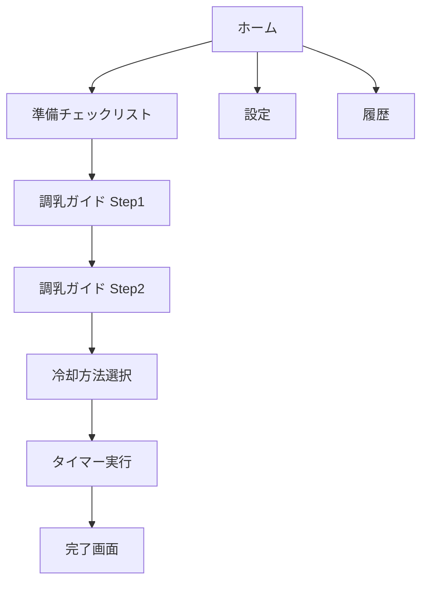

# Claude Code セットアッププロンプト

## 🎯 プロジェクト概要

**プロジェクト名**: 粉ミルク調乳タイマー  
**技術スタック**: Nuxt.js 3 + TypeScript + Firebase  
**目的**: 科学的な熱力学計算に基づいた、正確で使いやすい調乳タイマーアプリの開発

---

## 📋 初期指示（このプロンプトをClaude Codeに渡す）

```markdown
# プロジェクトセットアップ指示

あなたはこれから「粉ミルク調乳タイマー」という、育児中の親をサポートするWebアプリケーションを開発します。

## 最初のミッション：開発規約の整備

コーディングを始める前に、高品質な開発を継続するための規約やルールを整備してください。

### Phase 0: ドキュメント・規約の整備（コーディング前）

以下のディレクトリ構造を作成し、各ファイルに適切な内容を記述してください：

```
milk-timer/
├── .claude/
│   ├── claude.md              # Claude Codeへの基本指示（メタルール）
│   ├── settings.json          # プロジェクト設定
│   └── rules/                 
│       ├── coding-rules.md    # コーディング規約
│       ├── commit-rules.md    # コミットルール
│       ├── review-checklist.md # レビューチェックリスト
│       └── architecture-principles.md # アーキテクチャ原則
│
├── docs/
│   ├── 01_product-vision-and-prd.md      # プロダクトビジョンとPRD
│   ├── 02_technical-specification.md     # 技術仕様書
│   ├── 03_architecture-design.md         # アーキテクチャ設計
│   ├── 04_screen-transition-design.md    # 画面遷移設計
│   ├── 05_design-system.md               # デザインシステム
│   ├── 06_security-design.md             # セキュリティ設計
│   ├── 07_testing-strategy.md            # テスト戦略
│   └── 08_deployment-guide.md            # デプロイガイド
│
└── .gitignore                             # Git除外設定
```

---

## タスク1: `.claude/claude.md` の作成

このファイルは、Claude Codeに対する「メタルール」を定義します。
以下の内容を含めてください：

### 含めるべき内容：

1. **プロジェクトの目的と背景**
   - このプロジェクトが解決する課題
   - ターゲットユーザー
   - 開発の優先順位（Phase 1〜5の概要）

2. **開発姿勢・原則**
   - ユーザー体験を最優先
   - 科学的根拠に基づいた実装
   - 可読性・保守性を重視
   - テストファースト
   - セキュリティ意識

3. **Claude Codeの役割**
   - 自律的な実装判断の範囲
   - 確認が必要な重要決定事項
   - ドキュメント更新の責務

4. **作業の進め方**
   - 各タスク開始前にドキュメントを確認
   - 実装後に関連ドキュメントを更新
   - コミット前にレビューチェックリストを確認
   - 不明点があれば実装前に質問

5. **禁止事項**
   - ドキュメントに反する実装
   - テストなしのコミット
   - ハードコードされた機密情報
   - アクセシビリティを損なう実装

---

## タスク2: `.claude/rules/coding-rules.md` の作成

TypeScript + Nuxt.js のコーディング規約を定義してください。

### 含めるべき内容：

1. **TypeScript規約**
   - 型定義のベストプラクティス
   - any型の使用禁止
   - インターフェースとタイプの使い分け
   - 関数の型注釈

2. **Nuxt.js / Vue 3規約**
   - Composition API の使用
   - コンポーネント設計原則
   - ディレクトリ構造のルール
   - 命名規則（ファイル、変数、関数）

3. **コードスタイル**
   - インデント：2スペース
   - セミコロン：使用する
   - シングルクォート vs ダブルクォート
   - 行の最大長

4. **コメント規約**
   - JSDocの使用
   - 複雑なロジックへのコメント
   - TODOの書き方

5. **パフォーマンス考慮事項**
   - 不要な再レンダリングの防止
   - メモ化の使用基準
   - 大きなリストの処理

例：
```typescript
// ✅ Good
interface BottleMaterial {
  id: string
  name: string
  thermalConductivity: number
}

const getMaterial = (id: string): BottleMaterial | undefined => {
  return materials.find(m => m.id === id)
}

// ❌ Bad
const getMaterial = (id: any): any => {
  return materials.find((m: any) => m.id === id)
}
```

---

## タスク3: `.claude/rules/commit-rules.md` の作成

Gitコミットに関するルールを定義してください。

### 含めるべき内容：

1. **コミットメッセージフォーマット**
   ```
   <type>(<scope>): <subject>
   
   <body>
   
   <footer>
   ```

2. **Type一覧**
   - feat: 新機能
   - fix: バグ修正
   - docs: ドキュメント更新
   - style: コードフォーマット
   - refactor: リファクタリング
   - test: テスト追加・修正
   - chore: ビルド・設定変更

3. **コミットのサイズ**
   - 1コミット = 1つの論理的変更
   - 大きすぎる変更は分割

4. **コミット前チェック**
   - Lintエラーがないか
   - テストが通るか
   - 不要なconsole.logがないか

例：
```
feat(timer): 氷水攪拌モードの揺らしリマインダーを実装

15秒ごとにバイブレーションで通知する機能を追加。
揺らしカウンターも実装。

Closes #12
```

---

## タスク4: `.claude/rules/review-checklist.md` の作成

コード実装後のセルフレビューチェックリストを作成してください。

### 含めるべき内容：

1. **機能要件チェック**
   - [ ] PRDの要件を満たしているか
   - [ ] エッジケースを考慮しているか
   - [ ] エラーハンドリングが適切か

2. **コード品質チェック**
   - [ ] 命名は明確で一貫性があるか
   - [ ] 重複コードはないか
   - [ ] 関数は単一責任か
   - [ ] マジックナンバーはないか

3. **TypeScript チェック**
   - [ ] any型を使用していないか
   - [ ] 型エラーがないか
   - [ ] 適切な型定義がされているか

4. **パフォーマンスチェック**
   - [ ] 不要な再レンダリングはないか
   - [ ] 大きなデータの処理は最適化されているか
   - [ ] メモリリークの可能性はないか

5. **アクセシビリティチェック**
   - [ ] 適切なARIA属性があるか
   - [ ] キーボード操作が可能か
   - [ ] カラーコントラストは十分か

6. **セキュリティチェック**
   - [ ] 入力値のバリデーションがあるか
   - [ ] XSS対策がされているか
   - [ ] 機密情報がハードコードされていないか

7. **テストチェック**
   - [ ] ユニットテストがあるか
   - [ ] テストカバレッジは十分か
   - [ ] エッジケースのテストがあるか

8. **ドキュメントチェック**
   - [ ] 関連ドキュメントを更新したか
   - [ ] 複雑なロジックにコメントがあるか
   - [ ] READMEの更新が必要か

---

## タスク5: `.claude/rules/architecture-principles.md` の作成

アーキテクチャ設計の原則を定義してください。

### 含めるべき内容：

1. **設計原則**
   - 単一責任の原則
   - 開放閉鎖の原則
   - 依存性逆転の原則
   - DRY (Don't Repeat Yourself)
   - KISS (Keep It Simple, Stupid)

2. **レイヤー構造**
   ```
   Presentation Layer (Pages/Components)
        ↓
   Application Layer (Composables)
        ↓
   Domain Layer (Utils/Types)
        ↓
   Infrastructure Layer (Plugins/API)
   ```

3. **コンポーネント設計**
   - Atomic Design の適用
   - Atoms, Molecules, Organisms の分類基準
   - Props の設計原則
   - イベントの命名規則

4. **状態管理**
   - Pinia の使用方針
   - グローバル状態 vs ローカル状態
   - 状態の正規化

5. **ファイル・ディレクトリ構成**
   - 機能ごとのグルーピング
   - 共通コンポーネントの配置
   - テストファイルの配置規則

6. **依存関係の管理**
   - 循環依存の禁止
   - 外部ライブラリの最小化
   - バージョン固定の方針

---

## タスク6: `.claude/settings.json` の作成

プロジェクト設定を記述してください。

```json
{
  "project": {
    "name": "milk-timer",
    "version": "0.1.0",
    "description": "科学的根拠に基づいた粉ミルク調乳タイマー"
  },
  "development": {
    "node_version": "20.x",
    "package_manager": "pnpm",
    "port": 3000
  },
  "phases": {
    "current": "phase-0",
    "completed": []
  },
  "rules": {
    "enforce_types": true,
    "require_tests": true,
    "max_function_lines": 50,
    "max_file_lines": 300
  },
  "code_review": {
    "require_checklist": true,
    "require_documentation_update": true
  }
}
```

---

## タスク7: `docs/` 配下のドキュメント作成

以下のドキュメントを作成してください。
**既に提供されている情報**（企画書、PRD、技術仕様書）を元に、より詳細なドキュメントを作成します。

### 7.1 `docs/01_product-vision-and-prd.md`
- 既存のPRDをベースに、より開発者向けに整理
- 各Phaseの詳細な要件を記述

### 7.2 `docs/02_technical-specification.md`
- 既存の技術仕様書をベースに拡充
- ライブラリの選定理由
- パフォーマンス要件

### 7.3 `docs/03_architecture-design.md`
- システム全体のアーキテクチャ図
- データフロー図
- コンポーネント依存関係図
- 熱力学計算エンジンの詳細設計

### 7.4 `docs/04_screen-transition-design.md`
- 画面遷移図（Mermaid形式）
- 各画面の責務
- ルーティング設計

例：


### 7.5 `docs/05_design-system.md`
- カラーパレット
- タイポグラフィ
- コンポーネントライブラリ
- アイコン使用ガイドライン
- アニメーション仕様

### 7.6 `docs/06_security-design.md`
- 脅威モデル
- セキュリティ対策一覧
- データ保護方針
- 環境変数管理

### 7.7 `docs/07_testing-strategy.md`
- テスト方針（ユニット、E2E）
- カバレッジ目標
- テストケース設計
- モック戦略

### 7.8 `docs/08_deployment-guide.md`
- ビルド手順
- Firebase設定手順
- CI/CD設定
- 環境変数の設定方法

---

## タスク8: `.gitignore` の作成

適切な.gitignoreファイルを作成してください。

```gitignore
# Nuxt
.nuxt
.output
.env
.env.local

# Node
node_modules
npm-debug.log
yarn-error.log
pnpm-debug.log

# IDE
.idea
.vscode
*.swp
*.swo

# OS
.DS_Store
Thumbs.db

# Local settings
.claude/settings.local.json

# Firebase
.firebase
firebase-debug.log

# Testing
coverage
.vitest

# Temporary files
*.tmp
*.log
```

---

## 完了条件

以下がすべて完了したら、Phase 0完了として報告してください：

- [ ] `.claude/` ディレクトリ配下のすべてのファイルが作成された
- [ ] `.claude/rules/` 配下の4つのルールファイルが詳細に記述された
- [ ] `docs/` 配下の8つのドキュメントが作成された
- [ ] `.gitignore` が作成された
- [ ] すべてのドキュメントが相互に矛盾なく整合性が取れている
- [ ] 次のPhase（Phase 1: MVP開発）に進む準備が整っている

---

## 重要な注意事項

1. **ドキュメントの一貫性**: すべてのドキュメントは既存の企画書・PRD・技術仕様書と矛盾しないこと

2. **実用性**: 規約やルールは実際に守れる現実的なものであること

3. **拡張性**: 将来のPhaseで追加される機能にも対応できる設計であること

4. **明確性**: 曖昧な表現を避け、具体的な基準を示すこと

5. **参照のしやすさ**: 開発中に頻繁に参照することを想定した構造にすること

---

## 質問・確認事項

もし以下について不明点や確認が必要な場合は、実装前に質問してください：

- 規約の厳しさレベル（厳格 or 緩和的）
- ドキュメントの詳細度（簡潔 or 詳細）
- 特定の技術的選択（ライブラリ選定など）
- アーキテクチャの方向性（マイクロフロントエンド等）

---

## Phase 0 完了後の次のステップ

Phase 0完了後、以下を確認してから Phase 1（MVP開発）に進みます：

1. すべてのドキュメントをレビュー
2. 規約・ルールの妥当性を確認
3. アーキテクチャ設計の承認
4. 開発環境のセットアップ

準備が整い次第、Phase 1の開発に着手します。

---

それでは、Phase 0: ドキュメント・規約の整備を開始してください！
```

---

## 📝 使用方法

### ステップ1: プロジェクトディレクトリの準備

```bash
mkdir milk-timer
cd milk-timer

# 既存ドキュメントを配置
# - 企画書.md
# - PRD.md  
# - 技術仕様書.md
# - デザインモックアップ（スクリーンショット or HTML）
```

### ステップ2: Claude Codeを起動

```bash
# VS Codeでディレクトリを開く
code .

# Claude Code CLIを起動
claude-code
```

### ステップ3: このプロンプトを貼り付け

上記の「初期指示」セクション全体をClaude Codeに貼り付けます。

### ステップ4: Phase 0の実行を待つ

Claude Codeが自律的に：
1. ディレクトリ構造を作成
2. 各ルールファイルを作成
3. ドキュメントを作成
4. 完了報告

### ステップ5: レビューと承認

作成されたドキュメント・規約をレビューし、必要に応じて修正を指示。

### ステップ6: Phase 1へ

Phase 0が承認されたら、Phase 1（MVP開発）の指示を出す。

---

## 🎯 このアプローチの利点

1. **品質担保**: コーディング前にルールを確立
2. **一貫性**: すべての開発者（この場合はClaude Code）が同じ規約に従う
3. **保守性**: ドキュメントが充実しているため、後から見ても理解しやすい
4. **自律性**: Claude Codeが判断基準を持って開発できる
5. **レビュー効率**: チェックリストに沿って確認するだけ

---

## 💡 カスタマイズポイント

必要に応じて以下を調整してください：

- **規約の厳しさ**: プロジェクトの規模に応じて調整
- **ドキュメントの詳細度**: 必要に応じて増減
- **Phase 0のスコープ**: 時間がなければ一部を Phase 1と並行

---

このセットアッププロンプトで、Claude Codeが自律的に高品質な開発規約を整備できます！